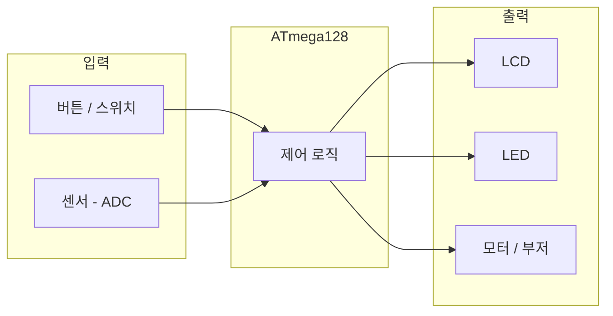
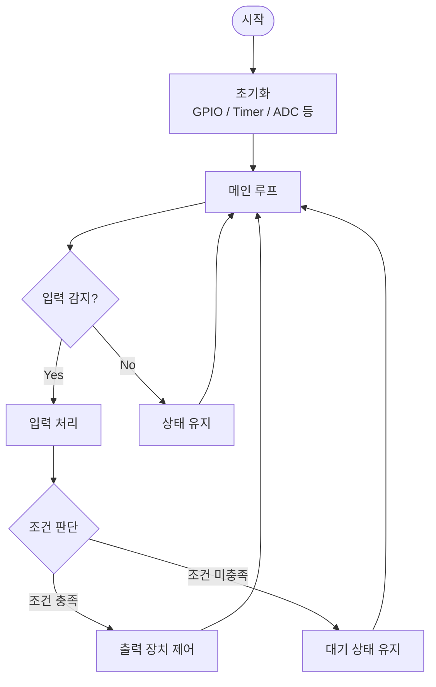
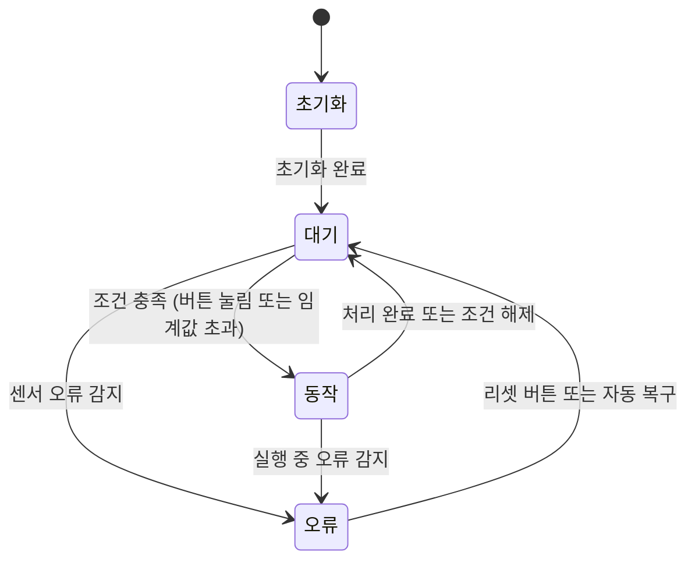

# Stage ③④ — 시스템 설계서 + 회로 설계서

> **Stage ③** 시스템 설계 → **Gate ③** 통과 기준: 블록도·동작 흐름도·상태 전이도 완성
> **Stage ④** 회로 설계 → **Gate ④** 통과 기준: 핀맵·회로도·부품 목록표·회로 검토표 완성

---

## 제출 정보

| 항목 | 내용 |
|------|------|
| 학번 | |
| 이름 | |
| 프로젝트 제목 | |
| 작성일 | |

---

# Stage ③ — 시스템 설계

## 1. 전체 시스템 블록도

> ATmega128을 중심으로 입력 장치·출력 장치·통신 방식·전원 구성을 블록 형태로 표현한다.
> Mermaid 다이어그램 또는 텍스트 블록으로 작성한다.

(위 예시를 본인 시스템에 맞게 수정)

---

## 2. 동작 흐름도

> 시스템의 전체 동작 순서를 플로우차트로 표현한다.
> Stage ②에서 작성한 동작 시나리오를 바탕으로 작성한다.

(위 예시를 본인 시스템 흐름에 맞게 수정)

---

## 3. 상태 전이도

> 시스템이 가질 수 있는 **상태**와 상태 사이의 **전이 조건**을 표현한다.
> 단순한 시스템도 최소 3개 이상의 상태를 구분하면 설계가 명확해진다.

**상태 목록 (먼저 정의)**

| 상태명 | 설명 |
|--------|------|
| 초기화 | 전원 ON 후 모든 주변기기 설정 완료 전 |
| 대기 | 입력 대기 중 |
| 동작 | 입력 감지 후 출력 장치 제어 중 |
| 오류 | 예외 상황 감지 (센서 오류 등) |

**상태 전이도 (Mermaid)**

(전이 조건을 본인 시스템에 맞게 수정)

---

## Gate ③ 자가 점검

- [ ] 시스템 블록도가 작성되어 있다 (입력·처리·출력 구조 명확)
- [ ] 동작 흐름도가 작성되어 있다 (Stage ② 시나리오 반영)
- [ ] 상태 전이도가 작성되어 있다 (3개 이상 상태 포함)
- [ ] Stage ②의 기능 요구사항(FR)이 설계에 반영되었다

---

# Stage ④ — 회로 설계

## 4. 핀맵 정의서 (ATmega128 핀 배치표)

> 사용하는 모든 핀을 빠짐없이 작성한다.
> PAMS-AEB V9.1 보드의 기본 연결도 사용하는 경우 포함한다.

| 포트·핀 | 방향 | 연결 장치 | 동작 설명 | 비고 |
|---------|------|-----------|-----------|------|
| PA0 | | | | ADC0 |
| PA1 | | | | ADC1 |
| PA2 | | | | ADC2 |
| PA3 | | | | ADC3 |
| PB0 | | | | SPI SS |
| PB1 | | | | SPI SCK |
| PB2 | | | | SPI MOSI |
| PB3 | | | | SPI MISO |
| PC0 | | | | |
| PC1 | | | | |
| PD0 | | | | INT0 |
| PD1 | | | | INT1 |
| PD2 | | | | INT2 |
| PD3 | | | | INT3 |
| PE0 | | | | RXD0 |
| PE1 | | | | TXD0 |
| PF0 | | | | ADC0 |
| PF1 | | | | ADC1 |

> 사용하지 않는 핀은 "미사용" 표기 또는 삭제.
> 방향: Input / Output / BiDir

---

## 5. 회로도

> 회로도 파일을 `Phase3_회로/` 폴더에 저장하고 파일명을 기재한다.

| 항목 | 내용 |
|------|------|
| 파일명 | (예: `회로도_v1.jpg`) |
| 버전 | v1 |

**회로도 필수 표기 확인**

- [ ] ATmega128 포트 핀 번호 표기
- [ ] 연결 부품명 및 부품 값 (저항 Ω, 커패시터 μF) 표기
- [ ] VCC 및 GND 연결 표기
- [ ] 외부 모듈 연결 표기

---

## 6. 부품 목록표

> 프로젝트에 사용되는 모든 부품을 정리한다.

| # | 부품명 | 규격·모델명 | 수량 | 용도 | PAMS 내장 | 비고 |
|---|--------|------------|------|------|-----------|------|
| 1 | ATmega128 | — | 1 | MCU | ✅ | |
| 2 | | | | | ✅ / ❌ | |
| 3 | | | | | ✅ / ❌ | |
| 4 | | | | | ✅ / ❌ | |
| 5 | | | | | ✅ / ❌ | |
| 6 | | | | | ✅ / ❌ | |

> **데이터시트 링크** (외부 모듈 사용 시)

| 부품명 | 데이터시트 URL |
|--------|----------------|
| | |

---

## 7. 회로 검토표

> 회로 제작 전에 반드시 확인한다. 전원·GND 오결선은 부품 손상으로 직결된다.

| 검토 항목 | 확인 내용 | 결과 |
|-----------|-----------|------|
| VCC 연결 | 각 부품의 VCC가 올바른 전압(3.3V / 5V)에 연결되었는가 | ✅ / ❌ |
| GND 연결 | 모든 부품의 GND가 공통 GND에 연결되었는가 | ✅ / ❌ |
| LED 직렬 저항 | LED 각각에 전류 제한 저항이 있는가 | ✅ / ❌ / 해당없음 |
| 풀업·풀다운 저항 | 버튼·스위치에 풀업 또는 풀다운 저항이 있는가 | ✅ / ❌ / 해당없음 |
| 방향성 부품 극성 | 전해 커패시터, 다이오드, 전해질 LED 극성이 맞는가 | ✅ / ❌ / 해당없음 |
| 핀 충돌 여부 | 동일한 핀에 두 가지 기능이 중복 할당되어 있지 않은가 | ✅ / ❌ |
| 핀맵과 실물 일치 | 핀맵 정의서와 실제 배선이 일치하는가 | ✅ / ❌ |
| 전원 인가 전 단락 | 멀티미터로 VCC-GND 단락 여부 확인 | ✅ / ❌ |

---

## 8. 회로 변경 이력

> 설계 완료 후 회로가 변경된 경우 기록한다.

| 날짜 | 변경 내용 | 변경 이유 |
|------|-----------|-----------|
| | | |

---

## Gate ④ 자가 점검

- [ ] 핀맵 정의서에 사용하는 모든 핀이 기재되어 있다
- [ ] 회로도 파일이 `Phase3_회로/` 폴더에 있다
- [ ] 부품 목록표가 작성되어 있다
- [ ] 회로 검토표의 모든 항목이 ✅ 또는 "해당없음"이다
- [ ] Stage ③의 블록도와 이 단계의 핀맵이 일치한다
