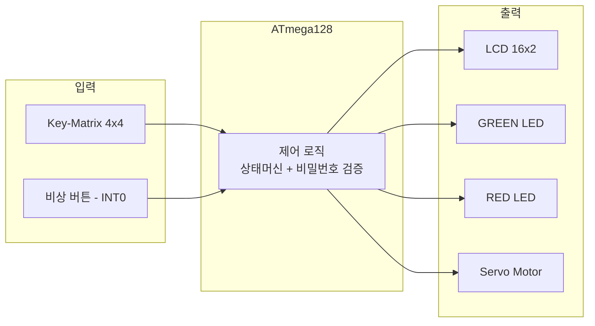
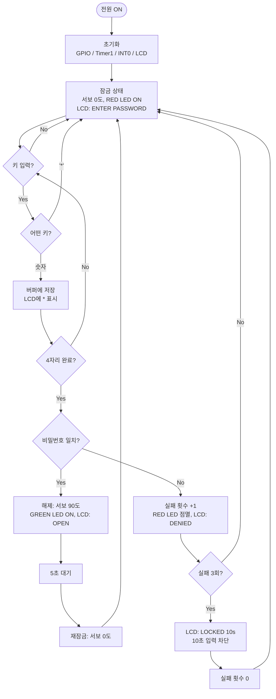
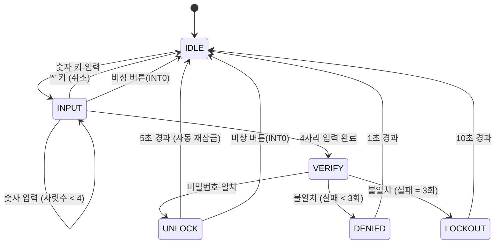

# 【샘플 보고서】디지털 도어락 — 4자리 비밀번호 전자 잠금장치

> ⭐ **이 문서는 모범 작성 예시입니다.**
> - 목적: Phase 1~4 양식의 **각 칸을 어느 수준으로 채워야 하는지** 실제 예시로 보여주기 위함.
> - 사용법: 본인 프로젝트 주제로 **양식을 직접 채우되**, 칸별 서술 수준·구체성·연결 방식을 이 예시에서 참고할 것. **내용을 그대로 베끼지 말 것**(주제가 다르면 베껴도 맞지 않음).
> - 예시 주제는 양식 내장 예시(온도/팬)와 **일부러 다른** "디지털 도어락"으로 선정 — 설계 사고 과정을 새 주제에서 보여주기 위함.
> - 보드: **PAMS-AEB V9.1** 실제 탑재 부품만 사용 (Key-Matrix·LCD·Servo·LED·외부 인터럽트). 부저 미탑재 → 경고는 RED LED 점멸로 대체.

> **제출 정보 (예시)**

| 항목 | 내용 |
|------|------|
| 학번 | 2026000000 |
| 이름 | 홍길동 (예시) |
| 프로젝트 제목 | 디지털 도어락 — 4자리 비밀번호 전자 잠금장치 |
| 작성일 | 2026-06-26 |

---
---

# 📘 Phase 1 (Stage ①②) — 제안서 + 요구사항 정의서

# Stage ① — 주제 정의

## 1. 프로젝트 제안서

### 1-1. 시스템 개요

이 시스템은 4×4 키패드로 4자리 비밀번호를 입력받아, 사전에 저장된 비밀번호와 일치하면 RC 서보모터를 회전시켜 잠금을 해제하고 LCD에 "OPEN"을 표시한다. 비밀번호가 틀리면 RED LED를 빠르게 점멸시켜 경고하며, 3회 연속 틀리면 10초 동안 입력을 차단하는 잠금(Lockout) 상태로 전환된다. 잠금 해제 후 5초가 지나면 자동으로 다시 잠긴다.

### 1-2. 프로젝트 목적

기계식 열쇠 없이 비밀번호만으로 출입을 통제하고, 반복 오입력에 대응하는 보안 동작(경고·일시 잠금)을 갖춘 소형 전자 잠금장치를 구현한다. 키 분실·복제 위험을 없애는 것이 목표다.

### 1-3. 주요 기능 목록 (요약)

1. 4×4 키패드로 비밀번호 입력 (LCD에 입력 자릿수를 `*`로 표시)
2. 입력값과 저장된 비밀번호 비교 → 일치 시 서보모터로 잠금 해제
3. 불일치 시 RED LED 점멸 경고, 3회 연속 실패 시 10초 잠금
4. 잠금 해제 5초 후 자동 재잠금
5. 비상 잠금 버튼(외부 인터럽트)으로 어느 상태에서나 즉시 잠금 복귀

### 1-4. 사용 예정 부품

| 부품명 | 용도 | PAMS 보드 내장 여부 |
|--------|------|---------------------|
| ATmega128 | MCU | 내장 |
| Key-Matrix (4×4) | 비밀번호 입력 | 내장 |
| Character LCD (16×2) | 상태·입력 표시 | 내장 |
| RC Servo Motor | 잠금/해제 액추에이터 | 내장 |
| LED (GREEN 1, RED 1) | 해제 표시 / 경고 | 내장 |
| 인터럽트 전용 Tack SW | 비상 잠금 (INT0) | 내장 |

### 1-5. 예상 동작 요약

1. 전원 ON → 잠금 상태(서보 0°), LCD "ENTER PASSWORD" 표시, RED LED 점등
2. 키패드로 4자리 입력 → 일치 시 서보 90° 회전·GREEN LED·LCD "OPEN"
3. 5초 후 자동 재잠금 → 1번 상태로 복귀

---

## 2. 기능 목록표

| 기능 ID | 기능 설명 | 분류 | 사용 주변기기 |
|---------|-----------|------|---------------|
| F-01 | 4×4 키패드로 숫자 4자리를 입력받는다 | 필수 | Key-Matrix |
| F-02 | 입력 진행 상황을 LCD에 `*`로 표시한다 | 필수 | LCD |
| F-03 | 저장된 비밀번호와 비교해 일치/불일치를 판정한다 | 필수 | (MCU 내부) |
| F-04 | 일치 시 서보를 90°로 회전해 잠금을 해제한다 | 필수 | Servo, GREEN LED |
| F-05 | 불일치 시 RED LED를 점멸해 경고한다 | 필수 | RED LED |
| F-06 | 3회 연속 실패 시 10초간 입력을 차단한다 | 필수 | Timer, LCD |
| F-07 | 해제 5초 후 자동으로 재잠금한다 | 필수 | Timer, Servo |
| F-08 | 비상 버튼으로 즉시 잠금 복귀한다 | 필수 | 외부 인터럽트(INT0) |
| F-09 | `*` 키로 입력 중인 비밀번호를 취소한다 | 선택 | Key-Matrix |
| F-10 | 비밀번호를 사용자가 변경한다(관리자 모드) | 선택 | Key-Matrix, EEPROM |

> **필수 기능**: F-01~F-08 — 시연에서 반드시 보여야 하는 핵심 동작.
> **선택 기능**: F-09~F-10 — 시간 여유 시 추가, 미구현 시 감점 없음.

---

## 3. 구현 가능성 검토표

| 검토 항목 | 내용 | 검토 결과 |
|-----------|------|-----------|
| 사용할 센서·입력 장치 | Key-Matrix 4×4, 비상 버튼(INT0) | 가능 |
| 사용할 출력 장치 | LCD 16×2, Servo, LED 2개 | 가능 |
| 필요한 ATmega128 주변기기 | GPIO, Timer1(서보 PWM), 외부 인터럽트 | 가능 |
| GPIO 핀 수 충분 여부 | 필요 핀 수: 16개 (키매트릭스 8 + LCD 6 + 서보 1 + LED 2 + INT0 1 = 18) | 충분 (PORTA·C·G·B·D 분산) |
| 전원 요구 사항 | 서보·로직 모두 보드 5V로 동작 | USB 공급으로 가능 |
| 예상 난이도 | 키매트릭스 스캔 + 서보 PWM + 상태 관리 | 보통 |
| 남은 기간 내 구현 가능 여부 | 5주 | 가능 |

**범위 축소가 필요한 경우 조정 내용**:

선택 기능(F-09 취소, F-10 비밀번호 변경)을 먼저 제거한다. 그래도 일정이 부족하면 F-06(3회 실패 잠금)을 단순 경고로 축소하고, 핵심인 입력→검증→해제(F-01~F-05, F-07)와 비상 잠금(F-08)만 남긴다.

---

## Gate ① 자가 점검

- [x] 프로젝트 제목이 시스템 기능을 반영한다
- [x] 시스템 개요가 2문장 이상 구체적으로 작성되었다
- [x] 기능 목록에서 필수와 선택 기능이 구분되어 있다
- [x] 사용 예정 부품이 PAMS 보드 또는 실습실 보유 부품인지 확인되었다
- [x] 구현 가능성 검토표의 모든 항목이 작성되었다
- [x] 남은 기간 이내 구현 가능한 수준으로 범위가 조정되었다

---

# Stage ② — 요구사항 정의

## 4. 기능 요구사항 (Functional Requirements)

| ID | 요구사항 | 우선순위 |
|----|----------|----------|
| FR-01 | 키패드에서 눌린 키 값을 50ms 이내에 인식한다. | 높음 |
| FR-02 | 입력된 자릿수만큼 LCD 2행에 `*`를 표시한다. | 높음 |
| FR-03 | 4자리가 입력되면 저장된 비밀번호와 비교한다. | 높음 |
| FR-04 | 비밀번호가 일치하면 서보를 90°로 회전시켜 잠금을 해제한다. | 높음 |
| FR-05 | 비밀번호가 일치하면 GREEN LED를 켜고 LCD에 "OPEN"을 표시한다. | 높음 |
| FR-06 | 비밀번호가 불일치하면 RED LED를 200ms 주기로 점멸한다. | 높음 |
| FR-07 | 3회 연속 불일치 시 10초간 모든 키 입력을 무시한다. | 중간 |
| FR-08 | 잠금 해제 후 5초가 지나면 서보를 0°로 되돌려 재잠금한다. | 높음 |
| FR-09 | 비상 버튼이 눌리면 즉시 서보를 0°로 잠그고 대기 상태로 돌아간다. | 중간 |
| FR-10 | `*` 키 입력 시 현재까지 입력한 비밀번호를 초기화한다. | 낮음 |

---

## 5. 비기능 요구사항 (Non-Functional Requirements)

| ID | 요구사항 | 비고 |
|----|----------|------|
| NFR-01 | 키 입력 응답 시간은 100ms 이내여야 한다. | 채터링 디바운스 포함 |
| NFR-02 | 서보 PWM은 주기 20ms, 펄스폭 0.6~2.4ms를 유지해야 한다. | RC 서보 규격 |
| NFR-03 | 전원 재인가 시 항상 잠금 상태로 초기화되어야 한다. | 안전 기본값 |
| NFR-04 | 10분 이상 연속 동작해도 오동작·재시작이 없어야 한다. | 안정성 |

---

## 6. 입출력 정의표

### 입력 장치

| 장치명 | 종류 | 연결 방식 | 역할 |
|--------|------|-----------|------|
| Key-Matrix 4×4 | 스위치(매트릭스) | GPIO (열 출력/행 입력) | 비밀번호·명령 입력 |
| 비상 잠금 버튼 | Tack SW | GPIO 외부 인터럽트(INT0) | 즉시 잠금 |

### 출력 장치

| 장치명 | 종류 | 연결 방식 | 역할 |
|--------|------|-----------|------|
| Character LCD 16×2 | LCD | GPIO (4비트 병렬) | 상태·입력 표시 |
| RC Servo Motor | 모터 | PWM (Timer1 OC1A) | 잠금/해제 구동 |
| GREEN LED | LED | GPIO (Active Low) | 해제 표시 |
| RED LED | LED | GPIO (Active Low) | 잠금·경고 표시 |

---

## 7. 동작 시나리오

### 정상 동작 시나리오

1. 전원이 켜지면 GPIO·Timer1·INT0·LCD를 초기화하고, 서보를 0°(잠금)로 두며 RED LED 점등 후 LCD에 "ENTER PASSWORD"를 표시한다.
2. 사용자가 키패드로 숫자를 누르면 입력 자릿수만큼 LCD 2행에 `*`를 표시한다.
3. 4자리가 모두 입력되면 저장된 비밀번호(`1234`)와 비교한다.
4. 일치하면 서보를 90°로 회전시키고, RED LED를 끄고 GREEN LED를 켜며 LCD에 "OPEN"을 표시한다.
5. 5초가 지나면 서보를 0°로 되돌리고 GREEN LED를 끈 뒤 1번의 대기 화면으로 복귀한다.

### 예외 동작 시나리오

| 예외 상황 | 시스템 반응 |
|-----------|-------------|
| 비밀번호 불일치 (3회 미만) | RED LED 200ms 점멸 1초 + LCD "DENIED" → 대기 화면 복귀, 실패 횟수 +1 |
| 비밀번호 3회 연속 불일치 | LCD "LOCKED 10s", 10초간 모든 키 입력 무시, 종료 후 실패 횟수 0으로 초기화 |
| 입력 중 `*` 키 | 입력 버퍼 초기화, LCD 입력 표시 지움 |
| 비상 버튼 눌림 | 어느 상태에서나 즉시 서보 0°(잠금) + 대기 화면 복귀 |

---

## Gate ② 자가 점검

- [x] 기능 요구사항(FR)이 5개 이상 작성되었다
- [x] 각 FR이 "~한다" 형식으로 단 하나의 동작만 포함하고 있다
- [x] 비기능 요구사항(NFR)이 2개 이상 작성되었다
- [x] 입출력 정의표에 모든 장치가 기재되었다
- [x] 동작 시나리오에 입력→처리→출력 흐름이 명확하다
- [x] Stage ①의 필수 기능이 FR 항목에 모두 반영되었다

---
---

# 📗 Phase 2 (Stage ③④) — 시스템 설계서 + 회로 설계서

# Stage ③ — 시스템 설계

## 1. 전체 시스템 블록도



---

## 2. 동작 흐름도



---

## 3. 상태 전이도

**상태 목록**

| 상태명 | 설명 |
|--------|------|
| IDLE (대기/잠금) | 서보 0°, RED LED 점등, "ENTER PASSWORD" 표시, 입력 대기 |
| INPUT (입력 중) | 키 입력을 버퍼에 누적, LCD에 `*` 표시 |
| VERIFY (검증) | 4자리 입력 완료 후 비밀번호 비교 (순간 상태) |
| UNLOCK (해제) | 서보 90°, GREEN LED, "OPEN" 표시, 5초 후 자동 잠금 |
| DENIED (거부) | RED LED 점멸, "DENIED" 표시, 실패 횟수 증가 |
| LOCKOUT (잠금) | 3회 실패, 10초간 입력 차단 |

**상태 전이도**



> 비상 버튼(INT0)은 어느 상태에서나 IDLE(잠금)로 강제 복귀시킨다(다이어그램에는 대표 경로만 표기).

---

## Gate ③ 자가 점검

- [x] 시스템 블록도가 작성되어 있다 (입력·처리·출력 구조 명확)
- [x] 동작 흐름도가 작성되어 있다 (Stage ② 시나리오 반영)
- [x] 상태 전이도가 작성되어 있다 (3개 이상 상태 포함 — 6개)
- [x] Stage ②의 기능 요구사항(FR)이 설계에 반영되었다

---

# Stage ④ — 회로 설계

## 4. 핀맵 정의서 (ATmega128 핀 배치표)

| 포트·핀 | 방향 | 연결 장치 | 동작 설명 | 비고 |
|---------|------|-----------|-----------|------|
| PA0~PA3 | Output | Key-Matrix 열 C0~C3 | 스캔 신호(LOW 순차 출력) | |
| PA4~PA7 | Input | Key-Matrix 행 R0~R3 | 키 감지(내부 풀업) | |
| PB0 | Output | GREEN LED | 해제 표시 (Active Low) | |
| PB1 | Output | RED LED | 잠금·경고 표시 (Active Low) | |
| PB5 | Output | Servo 신호선 | Timer1 OC1A PWM 출력 | OC1A |
| PC4 | Output | LCD D4 | LCD 데이터(4비트) | |
| PC5 | Output | LCD D5 | LCD 데이터(4비트) | |
| PC6 | Output | LCD D6 | LCD 데이터(4비트) | |
| PC7 | Output | LCD D7 | LCD 데이터(4비트) | |
| PG0 | Output | LCD RS | 명령/데이터 선택 | |
| PG1 | Output | LCD E | Enable (하강 에지 래치) | |
| PD0 | Input | 비상 잠금 버튼 | 외부 인터럽트(하강 에지) | INT0 |

> LCD R/W는 GND에 고정(쓰기 전용). 그 외 미사용 핀은 입력(풀업)으로 둔다.
> 방향: Input / Output

---

## 5. 회로도

| 항목 | 내용 |
|------|------|
| 파일명 | `회로도_도어락_v1.jpg` |
| 버전 | v1 |

**회로도 필수 표기 확인**

- [x] ATmega128 포트 핀 번호 표기
- [x] 연결 부품명 및 부품 값 (LED 직렬 330Ω, 서보 신호선) 표기
- [x] VCC 및 GND 연결 표기
- [x] 외부 모듈 연결 표기 (서보 3선: VCC/GND/신호)

---

## 6. 부품 목록표

| # | 부품명 | 규격·모델명 | 수량 | 용도 | PAMS 내장 | 비고 |
|---|--------|------------|------|------|-----------|------|
| 1 | ATmega128 | AVR 8bit, 16MHz | 1 | MCU | ✅ | |
| 2 | Key-Matrix | 4×4 Tack SW | 1 | 비밀번호 입력 | ✅ | 스캔 방식 |
| 3 | Character LCD | 16×2, HD44780 | 1 | 상태 표시 | ✅ | 4비트 모드 |
| 4 | RC Servo Motor | 0~180°, PWM 20ms | 1 | 잠금 구동 | ✅ | OC1A 제어 |
| 5 | LED | GREEN 1, RED 1 | 2 | 상태·경고 | ✅ | Active Low, 330Ω 내장 |
| 6 | Tack SW | 인터럽트 전용 | 1 | 비상 잠금 | ✅ | INT0 연결 |

> **데이터시트 링크** (외부 모듈 사용 시)

| 부품명 | 데이터시트 URL |
|--------|----------------|
| (해당 없음 — 전부 보드 내장) | — |

---

## 7. 회로 검토표

| 검토 항목 | 확인 내용 | 결과 |
|-----------|-----------|------|
| VCC 연결 | 서보·LCD·로직 모두 5V에 연결 | ✅ |
| GND 연결 | 모든 부품 GND 공통 연결 | ✅ |
| LED 직렬 저항 | LED 각 330Ω 내장 확인 | ✅ |
| 풀업·풀다운 저항 | 키매트릭스 행 입력 내부 풀업 활성 | ✅ |
| 방향성 부품 극성 | LED 극성, 서보 3선 순서(빨강VCC/검정GND/노랑신호) | ✅ |
| 핀 충돌 여부 | 키매트릭스(PA)·LCD(PC,PG)·서보(PB5)·LED(PB0,1)·INT0(PD0) 충돌 없음 | ✅ |
| 핀맵과 실물 일치 | 핀맵 정의서와 실제 배선 일치 | ✅ |
| 전원 인가 전 단락 | 멀티미터로 VCC-GND 단락 없음 확인 | ✅ |

---

## 8. 회로 변경 이력

| 날짜 | 변경 내용 | 변경 이유 |
|------|-----------|-----------|
| 2026-06-30 | 서보 신호선을 PB7→PB5로 변경 | PB5가 Timer1 OC1A로 하드웨어 PWM 직접 출력 가능 |

---

## Gate ④ 자가 점검

- [x] 핀맵 정의서에 사용하는 모든 핀이 기재되어 있다
- [x] 회로도 파일이 `Phase3_회로/` 폴더에 있다
- [x] 부품 목록표가 작성되어 있다
- [x] 회로 검토표의 모든 항목이 ✅ 또는 "해당없음"이다
- [x] Stage ③의 블록도와 이 단계의 핀맵이 일치한다

---
---

# 📙 Phase 3 (Stage ⑤⑥) — 펌웨어 구현 + 테스트·디버깅

# Stage ⑤ — 펌웨어 구현

## 1. 코드 구조 설명서

### 1-1. 파일 구조

```
2026000000_홍길동_하이테크프로젝트/Phase3_코드/
├── main.c          ← 초기화 호출 + 상태머신 메인 루프
├── config.h        ← F_CPU, 핀 정의, 비밀번호 상수
├── keypad.c/.h     ← 키매트릭스 스캔·디바운스
├── lcd.c/.h        ← LCD 4비트 제어
├── servo.c/.h      ← Timer1 PWM 서보 각도 제어
└── backup/         ← 날짜 기반 백업
```

### 1-2. 파일별 역할 정의

| 파일명 | 역할 | 포함할 함수 (예시) |
|--------|------|-------------------|
| `main.c` | 초기화 호출, 상태머신 루프 | `main`, `init_system` |
| `config.h` | 상수·핀 번호 정의 | (`#define`만) |
| `keypad.c` | 키매트릭스 스캔 | `keypad_scan` |
| `lcd.c` | LCD 제어 | `lcd_init`, `lcd_cmd`, `lcd_puts`, `lcd_clear` |
| `servo.c` | 서보 PWM | `servo_init`, `servo_set_angle` |

### 1-3. 주요 함수 설명표

| 파일 | 함수명 | 반환형 | 매개변수 | 기능 설명 |
|------|--------|--------|----------|-----------|
| main.c | `main` | `int` | 없음 | 초기화 + 상태머신 루프 |
| main.c | `init_system` | `void` | 없음 | 포트·Timer1·INT0·LCD 초기화 |
| keypad.c | `keypad_scan` | `char` | 없음 | 눌린 키 반환(없으면 0), 20ms 디바운스 |
| lcd.c | `lcd_init` | `void` | 없음 | 4비트 모드 초기화 |
| lcd.c | `lcd_puts` | `void` | `char *` | 문자열 출력 |
| servo.c | `servo_set_angle` | `void` | `uint8_t` | 0~180° → OC1A 펄스폭 설정 |

### 1-4. 코드 변경 기록

| 날짜 | 구현 기능 | 수정 내용 | 오류 해결 내용 |
|------|-----------|-----------|----------------|
| 2026-06-30 | 키매트릭스 스캔 | `keypad_scan` 구현 | 채터링으로 중복 입력 → 20ms 디바운스 추가 |
| 2026-07-02 | 서보 PWM | Timer1 Fast PWM(ICR1=4999, 분주 64) | 서보 떨림 → 펄스폭 계산식 보정 |
| 2026-07-04 | 상태머신 통합 | LOCKOUT·자동 재잠금 추가 | 5초 카운트가 블로킹 → Timer 카운터로 분리 |

---

## 2. 환경 설정 체크리스트

| # | 항목 | 완료 | 날짜 |
|---|------|------|------|
| 1 | Atmel Studio 7 프로젝트 생성 완료 | ☑ | 2026-06-30 |
| 2 | ATmega128 디바이스 선택 확인 | ☑ | 2026-06-30 |
| 3 | `config.h`에 `F_CPU` 정의 확인 (`16000000UL`) | ☑ | 2026-06-30 |
| 4 | 폴더 구조 생성 완료 | ☑ | 2026-06-30 |
| 5 | PAMS-AEB V9.1 보드 연결 및 전원 확인 | ☑ | 2026-06-30 |

---

## 3. 하드웨어 조립 체크리스트

| # | 항목 | 완료 | 날짜 |
|---|------|------|------|
| 1 | Stage ④ 핀맵과 실제 배선 일치 확인 | ☑ | 2026-07-01 |
| 2 | VCC / GND 연결 극성 확인 | ☑ | 2026-07-01 |
| 3 | Stage ④ 회로 검토표 전 항목 ✅ 확인 | ☑ | 2026-07-01 |
| 4 | 전원 인가 전 단락(쇼트) 점검 | ☑ | 2026-07-01 |
| 5 | 전원 인가 후 과열·연기 없음 확인 | ☑ | 2026-07-01 |

---

## 4. 주변기기별 단위 테스트

### GPIO (LED / 버튼)

| # | 테스트 항목 | 결과 | 날짜 |
|---|-------------|------|------|
| 1 | LED 개별 ON/OFF | ☑ Pass | 2026-06-30 |
| 2 | LED 점멸 (200ms 주기) | ☑ Pass | 2026-06-30 |
| 3 | 비상 버튼 입력 감지 | ☑ Pass | 2026-07-01 |
| 4 | 버튼 누름 → 서보 잠금 | ☑ Pass | 2026-07-04 |

### Timer / PWM

| # | 테스트 항목 | 결과 | 날짜 |
|---|-------------|------|------|
| 1 | Timer1 주기 확인 (20ms) | ☑ Pass | 2026-07-02 |
| 2 | PWM 출력 신호 확인 (오실로스코프) | ☑ Pass | 2026-07-02 |
| 3 | 펄스폭 0.6~2.4ms로 0~180° 도달 | ☑ Pass | 2026-07-02 |

### LCD

| # | 테스트 항목 | 결과 | 날짜 |
|---|-------------|------|------|
| 1 | LCD 초기화 및 화면 지우기 | ☑ Pass | 2026-07-01 |
| 2 | 문자열 출력 확인 | ☑ Pass | 2026-07-01 |
| 3 | 커서 위치 이동(2행) 확인 | ☑ Pass | 2026-07-01 |

### 기타 모듈 (Key-Matrix)

| # | 테스트 항목 | 결과 | 날짜 |
|---|-------------|------|------|
| 1 | 16개 키 값 정확 인식 (UART 출력 확인) | ☑ Pass | 2026-06-30 |
| 2 | 채터링 없이 1회 입력 1회 인식 | ☑ Pass | 2026-07-01 |

---

## 5. 코드 백업 기록

| 날짜 | 백업 파일명 | 백업 시점 | 주요 변경 내용 |
|------|-------------|-----------|----------------|
| 2026-06-30 | `main_20260630.c` | 기능 추가 전 | 키매트릭스+LCD 단위 동작 |
| 2026-07-02 | `main_20260702.c` | 기능 추가 전 | 서보 PWM 추가 |
| 2026-07-04 | `main_20260704.c` | 수업 전 | 상태머신 통합본 |

---

# Stage ⑥ — 테스트·디버깅

## 6. 테스트 계획서

| 테스트 ID | 구분 | 테스트 항목 | 입력 조건 | 기대 결과 |
|-----------|------|-------------|-----------|-----------|
| T-01 | 단위 | 키 입력 인식 | `1` 누름 | LCD에 `*` 1개 |
| T-02 | 단위 | 서보 각도 | `servo_set_angle(90)` | 서보 90° 회전 |
| T-03 | 통합 | 정답 입력 | `1234` 입력 | 서보 90°+GREEN+"OPEN" |
| T-04 | 통합 | 정상 시나리오 전 과정 | — | 입력→해제→5초→재잠금 정상 |
| T-05 | 예외 | 오답 3회 | 틀린 값 3회 | "LOCKED 10s" 후 복귀 |
| T-06 | 반복 | 10분 연속 동작 | — | 오동작·재시작 없음 |

---

## 7. 테스트 결과표

| 테스트 ID | 실제 결과 | 성공/실패 | 수정 사항 | 날짜 |
|-----------|-----------|-----------|-----------|------|
| T-01 | `*` 정상 표시 | ✅ | — | 2026-07-01 |
| T-02 | 90° 회전 확인 | ✅ | 펄스폭 보정 후 | 2026-07-02 |
| T-03 | 해제 동작 정상 | ✅ | — | 2026-07-04 |
| T-04 | 전 과정 정상 | ✅ | 5초 카운터 비블로킹 전환 후 | 2026-07-04 |
| T-05 | 잠금 후 복귀 정상 | ✅ | — | 2026-07-04 |
| T-06 | 10분 무오류 | ✅ | — | 2026-07-05 |

---

## 8. 오류 및 이슈 기록표

| # | 발생일 | 증상 | 원인 | 해결 방법 | 상태 |
|---|--------|------|------|-----------|------|
| 1 | 2026-06-30 | 키 1회 누름에 2~3자리 입력됨 | 기계식 접점 채터링 | 스캔 후 20ms 지연 + 키 뗌 확인 | 해결 |
| 2 | 2026-07-02 | 서보가 미세하게 떨림 | 펄스폭 계산 오차·전원 노이즈 | ICR1 기반 펄스폭 식 보정, 도달 후 정지 | 해결 |
| 3 | 2026-07-04 | 해제 5초 대기 중 키 입력 무반응 | `_delay_ms(5000)` 블로킹 | Timer 카운터 변수로 비블로킹 전환 | 해결 |
| 4 | 2026-07-05 | 비상 버튼 가끔 두 번 인식 | INT0 채터링 | ISR 내 짧은 무시 구간(소프트 디바운스) | 해결 |

> **미해결 이슈**: 없음.

---

## 9. 기능 요구사항 구현 현황

| FR ID | 요구사항 내용 | 구현 상태 | 테스트 결과 | 날짜 |
|-------|--------------|-----------|-------------|------|
| FR-01 | 키 50ms 이내 인식 | ☑ 완료 | ☑ Pass | 2026-06-30 |
| FR-02 | 입력 자릿수 `*` 표시 | ☑ 완료 | ☑ Pass | 2026-07-01 |
| FR-03 | 비밀번호 비교 | ☑ 완료 | ☑ Pass | 2026-07-04 |
| FR-04 | 일치 시 서보 90° | ☑ 완료 | ☑ Pass | 2026-07-04 |
| FR-05 | GREEN LED + "OPEN" | ☑ 완료 | ☑ Pass | 2026-07-04 |
| FR-06 | 불일치 RED LED 점멸 | ☑ 완료 | ☑ Pass | 2026-07-04 |
| FR-07 | 3회 실패 10초 잠금 | ☑ 완료 | ☑ Pass | 2026-07-04 |
| FR-08 | 5초 후 자동 재잠금 | ☑ 완료 | ☑ Pass | 2026-07-04 |
| FR-09 | 비상 버튼 즉시 잠금 | ☑ 완료 | ☑ Pass | 2026-07-04 |
| FR-10 | `*` 입력 취소 | ☑ 완료 | ☑ Pass | 2026-07-04 |

---

## Gate ⑥ 자가 점검 (시연 준비 완료 확인)

- [x] FR 중 우선순위 "높음" 항목 전부 ✅ Pass
- [x] 통합 테스트 T-04 (정상 동작 시나리오) ✅ Pass
- [x] T-06 10분 이상 연속 동작 안정성 확인
- [x] `backup/` 폴더에 최소 2개 이상 백업 파일 존재 (3개)
- [x] 코드 파일 헤더·함수 헤더 주석 작성 완료
- [x] 오류 기록표 미해결 이슈 없음 (전부 해결)

---
---

# 📕 Phase 4 (Stage ⑦) — 시연·최종 보고서

## 1. 프로젝트 개요

### 1-1. 시스템 설명

본 프로젝트는 ATmega128과 PAMS-AEB V9.1 보드로 구현한 4자리 비밀번호 디지털 도어락이다. 사용자가 4×4 키패드로 비밀번호를 입력하면 저장값과 비교해, 일치 시 RC 서보모터로 잠금을 해제하고 LCD에 "OPEN"을 표시한다. 불일치 시 RED LED가 점멸하며, 3회 연속 실패하면 10초간 입력이 차단된다. 해제 5초 후에는 자동으로 재잠금되고, 비상 버튼(외부 인터럽트)으로 어느 상태에서나 즉시 잠글 수 있다.

### 1-2. 사용 주변기기 요약

| 주변기기 | 용도 |
|----------|------|
| Key-Matrix 4×4 | 비밀번호 입력 |
| Character LCD 16×2 | 상태·입력 표시 |
| RC Servo (Timer1 PWM) | 잠금/해제 구동 |
| GREEN/RED LED | 해제 표시 / 경고 |
| 외부 인터럽트 INT0 | 비상 잠금 |

### 1-3. 최종 시스템 블록도

```
 [Key-Matrix 4x4]──┐                    ┌──► [LCD 16x2]  : 상태·입력
 [비상버튼 INT0]───┼──► [ATmega128]─────┼──► [GREEN LED] : 해제
                   │     상태머신        ├──► [RED LED]   : 경고
                   │                     └──► [Servo]     : 잠금/해제
                   └─────────────────────┘
```

---

## 2. 요구사항 달성 현황

| FR ID | 요구사항 내용 | 달성 여부 | 비고 |
|-------|--------------|-----------|------|
| FR-01 | 키 50ms 이내 인식 | ✅ 달성 | |
| FR-02 | 입력 자릿수 `*` 표시 | ✅ 달성 | |
| FR-03 | 비밀번호 비교 | ✅ 달성 | |
| FR-04 | 일치 시 서보 90° | ✅ 달성 | |
| FR-05 | GREEN LED + "OPEN" | ✅ 달성 | |
| FR-06 | 불일치 RED LED 점멸 | ✅ 달성 | |
| FR-07 | 3회 실패 10초 잠금 | ✅ 달성 | |
| FR-08 | 5초 후 자동 재잠금 | ✅ 달성 | |
| FR-09 | 비상 버튼 즉시 잠금 | ✅ 달성 | |
| FR-10 | `*` 입력 취소 | ✅ 달성 | 선택 기능까지 구현 |

**달성률**: 10 / 10 (100%)

---

## 3. 최종 회로도

**최종 핀 배치표**

| 포트·핀 | 방향 | 연결 장치 | 동작 설명 |
|---------|------|-----------|-----------|
| PA0~PA3 | Output | Key-Matrix 열 | 스캔 출력 |
| PA4~PA7 | Input | Key-Matrix 행 | 키 감지(풀업) |
| PB0 / PB1 | Output | GREEN / RED LED | 상태·경고 |
| PB5 | Output | Servo (OC1A) | PWM 잠금/해제 |
| PC4~PC7 | Output | LCD D4~D7 | 데이터 4비트 |
| PG0 / PG1 | Output | LCD RS / E | 제어 |
| PD0 | Input | 비상 버튼 | INT0 |

**회로도 파일**: `Phase3_회로/회로도_도어락_최종.jpg`

**Stage ④ 대비 변경 사항**

| 변경 내용 | 변경 이유 |
|-----------|-----------|
| 서보 신호선 PB7 → PB5 | Timer1 OC1A 하드웨어 PWM 직접 출력 |

---

## 4. 핵심 코드 설명

### 4-1. 초기화 코드

```c
// config.h
#define F_CPU 16000000UL
#define PASSWORD "1234"      // 저장된 비밀번호(4자리)

// main.c
void init_system(void) {
    // 1) 키매트릭스: 열(PA0~3) 출력, 행(PA4~7) 입력+풀업
    DDRA  = 0x0F;            // 하위 4비트 출력, 상위 4비트 입력
    PORTA = 0xF0;            // 행 입력에 내부 풀업

    // 2) LED: PB0(GREEN), PB1(RED) 출력 / 서보: PB5 출력
    DDRB  |= (1<<PB0)|(1<<PB1)|(1<<PB5);
    PORTB |= (1<<PB0)|(1<<PB1);   // Active Low → HIGH=소등(초기 OFF)

    lcd_init();             // LCD 4비트 초기화
    servo_init();           // Timer1 PWM 초기화

    // 3) INT0(PD0) 하강 에지 인터럽트
    EICRA |= (1<<ISC01);    // ISC01=1, ISC00=0 → 하강 에지
    EIMSK |= (1<<INT0);     // INT0 개별 허용
    sei();                  // 전역 인터럽트 허용
}
```

> **설명**: `DDRA=0x0F`로 키매트릭스 열만 출력으로 잡고 행은 입력+내부 풀업(`PORTA=0xF0`)으로 둔다. LED는 Active Low라 초기값을 HIGH(소등)로 둔다. INT0는 버튼이 눌리는 순간(HIGH→LOW)인 하강 에지로 설정하고, `sei()`로 전역 인터럽트를 켠다.

### 4-2. 핵심 기능 코드 1 — 키매트릭스 스캔

```c
// keypad.c — 4x4 매트릭스 스캔 (열 LOW 순차 출력 → 행 읽기)
const char KEYMAP[4][4] = {
    {'1','2','3','A'}, {'4','5','6','B'},
    {'7','8','9','C'}, {'*','0','#','D'}
};

char keypad_scan(void) {
    for (uint8_t col = 0; col < 4; col++) {
        PORTA = ~(1 << col) & 0x0F;     // 해당 열만 LOW
        PORTA |= 0xF0;                  // 행 풀업 유지
        _delay_us(5);
        uint8_t rows = (~PINA >> 4) & 0x0F;   // 눌린 행 = LOW
        if (rows) {
            for (uint8_t r = 0; r < 4; r++)
                if (rows & (1 << r)) {
                    _delay_ms(20);             // 디바운스
                    while (((~PINA >> 4) & 0x0F)) ; // 키 뗄 때까지 대기
                    return KEYMAP[r][col];
                }
        }
    }
    return 0;   // 입력 없음
}
```

> **설명**: 열을 하나씩 LOW로 출력하면서 행 입력을 읽어, LOW로 떨어진 행이 있으면 그 (행,열) 교차점이 눌린 키다. `KEYMAP`으로 문자를 환산한다. 채터링을 막기 위해 감지 후 20ms 지연하고, 키를 뗄 때까지 기다려 한 번의 누름이 한 번만 인식되게 한다.

### 4-3. 핵심 기능 코드 2 — 서보 각도 제어 (PWM)

```c
// servo.c — Timer1 Fast PWM, 주기 20ms (분주 64, ICR1=4999)
void servo_init(void) {
    DDRB |= (1<<PB5);                          // OC1A 출력
    TCCR1A = (1<<COM1A1) | (1<<WGM11);         // 비반전, Fast PWM
    TCCR1B = (1<<WGM13) | (1<<WGM12) | (1<<CS11) | (1<<CS10); // 분주 64
    ICR1 = 4999;                               // (16MHz/64)/50Hz - 1 = 4999 → 20ms
    servo_set_angle(0);                        // 초기 잠금
}

void servo_set_angle(uint8_t deg) {
    // 0° → 0.6ms(150), 180° → 2.4ms(600). 1tick=4us
    OCR1A = 150 + ((uint16_t)deg * 450) / 180;
}
```

> **설명**: Timer1을 Fast PWM 모드로 두고 `ICR1=4999`로 20ms 주기(서보 규격)를 만든다. 1 tick은 4µs이므로, 펄스폭 0.6ms=150tick(0°), 2.4ms=600tick(180°)에 대응한다. `servo_set_angle`은 각도를 이 범위로 선형 변환해 `OCR1A`에 넣는다. `servo_set_angle(90)`이면 잠금 해제 위치다.

### 4-4. 인터럽트 서비스 루틴 (ISR)

```c
// main.c — 비상 잠금 버튼(INT0)
volatile uint8_t g_force_lock = 0;

ISR(INT0_vect) {
    g_force_lock = 1;        // 메인 루프가 즉시 잠금 처리하도록 플래그만 설정
}
```

> **설명**: ISR은 짧게 유지하는 것이 원칙이므로, 여기서는 서보 제어를 직접 하지 않고 `g_force_lock` 플래그만 세운다. 메인 루프가 이 플래그를 보고 서보를 0°로 잠그고 대기 상태로 복귀한다. `volatile`은 ISR과 메인이 공유하는 변수가 최적화로 생략되지 않게 한다.

---

## 5. 발표자료 구성

| # | 항목 | 포함할 내용 | 완성 여부 |
|---|------|------------|-----------|
| 1 | 주제 및 목적 | 디지털 도어락, 키 분실·복제 위험 제거 | ☑ |
| 2 | 시스템 개요 | 최종 블록도, 전체 동작 흐름 | ☑ |
| 3 | 주요 기능 | FR 기반 기능, 필수 8종 100% 달성 | ☑ |
| 4 | 하드웨어 구성 | 최종 핀맵, 회로 실물 사진 | ☑ |
| 5 | 소프트웨어 구조 | 파일 구조, 상태 전이도 | ☑ |
| 6 | 동작 시연 | 라이브 시연(입력→해제→재잠금→오답잠금) | ☑ |
| 7 | 문제 해결 과정 | 채터링·서보 떨림·블로킹 해결 | ☑ |
| 8 | 개선 가능성 | 비밀번호 변경(EEPROM), 침입 로그 | ☑ |

**발표자료 파일**: `시연발표_도어락.pptx`

---

## 6. 최종 검증표

| 단계 | 확인 항목 | 기준 | 결과 |
|------|-----------|------|------|
| Stage ① | 프로젝트 제안서 | 기능 목록·검토표 포함 | ✅ |
| Stage ② | 요구사항 정의서 | FR 5+ , NFR 2+ | ✅ |
| Stage ③ | 시스템 설계서 | 블록도·흐름도·상태도 | ✅ |
| Stage ④ | 회로 설계서 | 핀맵·회로도·부품·검토표 | ✅ |
| Stage ⑤ | 펌웨어 구현 | 높음 FR 전부 구현 | ✅ |
| Stage ⑥ | 테스트 완료 | 정상 시나리오 통과 | ✅ |
| Stage ⑦ | 최종 보고서 | 전 섹션 작성 | ✅ |
| Stage ⑦ | 발표자료 | 8개 항목 완성 | ✅ |

**미완성 항목**: 없음.

---

## 7. 시연 결과

### 7-1. 정상 동작 시나리오 확인

| 시나리오 단계 | 예상 동작 | 실제 동작 | 일치 여부 |
|--------------|-----------|-----------|-----------|
| 1. 전원 ON | 잠금·RED LED·"ENTER PASSWORD" | 동일 | ✅ |
| 2. `1234` 입력 | LCD에 `****` | 동일 | ✅ |
| 3. 검증 일치 | 서보 90°·GREEN·"OPEN" | 동일 | ✅ |
| 4. 5초 경과 | 서보 0°·대기 복귀 | 동일 | ✅ |

### 7-2. 시연 사진 또는 영상 링크

| 항목 | 파일명 또는 링크 |
|------|----------------|
| 시연 사진 1 (잠금) | `Phase3_회로/시연_잠금.jpg` |
| 시연 사진 2 (해제) | `Phase3_회로/시연_해제.jpg` |
| 동작 영상 | `시연_도어락.mp4` |

---

## 8. 어려웠던 점 및 해결 방법

### 문제 1

- **증상**: 키패드를 한 번 눌렀는데 같은 숫자가 2~3번 입력됨.
- **원인**: 기계식 스위치 접점의 채터링(수 ms 진동)을 MCU가 여러 번 눌림으로 인식.
- **해결 방법**: 키 감지 후 20ms 지연을 두고, 키를 뗄 때까지 대기(`while`)하여 1회 누름을 1회만 처리하도록 했다.

### 문제 2

- **증상**: 서보가 목표 각도에서 멈추지 않고 미세하게 떨림.
- **원인**: 펄스폭 계산 오차로 기준 위치가 흔들렸고, 해제 후에도 PWM이 계속 갱신됨.
- **해결 방법**: `ICR1=4999` 기준으로 펄스폭 식(150~600 tick)을 정확히 맞추고, 목표 각도 도달 후에는 `OCR1A`를 다시 쓰지 않도록 했다.

### 문제 3

- **증상**: 해제 후 5초 대기 동안 키패드·비상버튼이 먹통이 됨.
- **원인**: `_delay_ms(5000)` 블로킹 지연이 그 시간 동안 CPU를 점유.
- **해결 방법**: 1ms 주기 카운터 변수로 5초를 비블로킹으로 세도록 바꿔, 대기 중에도 입력과 인터럽트가 동작하게 했다.

---

## 9. 결론 및 개선 방향

### 9-1. 결론

요구사항 10개(필수 8 + 선택 2)를 모두 구현하여 달성률 100%를 기록했다. 키매트릭스 스캔, 서보 PWM 제어, 외부 인터럽트, 상태머신 설계를 하나의 시스템으로 통합하는 과정을 경험했고, 특히 채터링·블로킹 같은 임베디드 특유의 문제를 직접 진단·해결하며 하드웨어와 펌웨어의 상호작용을 이해하게 되었다.

### 9-2. 개선 방향

| 항목 | 개선 방향 | 예상 구현 방법 |
|------|-----------|----------------|
| 기능 추가 | 비밀번호 사용자 변경 | 관리자 모드 + EEPROM에 비밀번호 저장 |
| 코드 개선 | 입력 타임아웃 | 일정 시간 무입력 시 자동 초기화(Timer) |
| 하드웨어 개선 | 침입 경고 강화 | Relay로 외부 경광등 연동(부저 미탑재 대체) |

---

## Gate ⑦ 자가 점검

- [x] 최종 검증표(§6)의 모든 항목이 ✅이다
- [x] 발표자료 8개 항목이 모두 완성되었다
- [x] 요구사항 달성 현황(§2)이 작성되었다 (달성률 100%)
- [x] 핵심 코드 설명(§4)에 설명 주석이 포함되어 있다
- [x] 시연 결과(§7)에 실제 동작 사진 또는 영상이 첨부되어 있다
- [x] 어려웠던 점(§8)이 최소 2개 이상 작성되었다 (3개)

---

*※ 본 문서는 디지털 도어락을 예시로 한 모범 작성 샘플입니다. 학생은 본인 주제로 양식을 채우되 서술 수준·구체성을 참고하십시오.*
