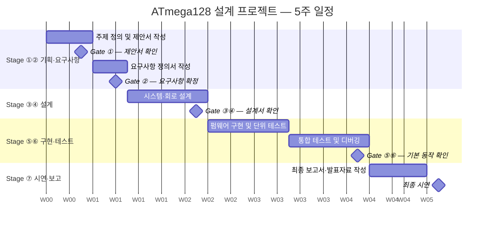

# ATmega128 임베디드 시스템 설계 프로젝트 — 운영 가이드

> **과목**: 하이테크 (KoPo 한국폴리텍대학교)
> **보드**: PAMS-AEB V9.1 (ATmega128 기반)
> **프로젝트 형태**: 개인 프로젝트
> **운영 기간**: 5주

---

## 1. 교육 목표와 체계

학생들이 단순히 "작동하는 결과물"만 만드는 것이 아니라 다음 전 과정을 경험하는 것이 목표다.

```
아이디어 → 요구사항 → 시스템 설계 → 회로 설계 → 펌웨어 구현 → 통합 테스트 → 시연·보고
```

이를 위해 프로젝트 교육은 **세 축**으로 운영한다.

| 축 | 내용 | 관련 단계 |
|----|------|----------|
| **프로젝트 관리** | 일정, 산출물, 이슈 관리 | 전 단계 |
| **기술 설계** | 시스템 구조, 회로, 입출력, 제어 로직 | Stage ①~④ |
| **개발 관리** | 코드 버전관리, 회로 파일 관리, 테스트 기록 | Stage ④~⑥ |

---

## 2. 프로젝트 7단계 구조

| Stage | 단계 | 주요 활동 | 핵심 산출물 |
|-------|------|-----------|------------|
| ① | 주제 정의 | 아이디어 → 구현 가능 범위로 축소 | 프로젝트 제안서, 기능 목록표, 구현 가능성 검토표 |
| ② | 요구사항 정의 | 기능·비기능 요구사항 구체화 | 요구사항 정의서, 입출력 정의표, 동작 시나리오 |
| ③ | 시스템 설계 | 전체 구조·제어 흐름 설계 | 시스템 설계서, 동작 흐름도, 상태 전이도 |
| ④ | 회로 설계 | 실제 연결 구조 설계 및 검토 | 핀맵 정의서, 회로도, 부품 목록표, 회로 검토표 |
| ⑤ | 펌웨어 구현 | 모듈별 코드 작성 및 단위 테스트 | 코드 구조 설명서, 주요 함수 설명표, 코드 변경 기록 |
| ⑥ | 테스트·디버깅 | 통합 테스트 및 오류 해결 | 테스트 계획서, 테스트 결과표, 오류 기록표, 최종 검증표 |
| ⑦ | 시연·보고 | 최종 결과 발표 및 보고서 제출 | 최종 보고서, 발표자료, 최종 코드·회로도 |

**Gate 통과 기준**: 각 단계의 핵심 산출물이 완성되어야 다음 단계로 진행 가능.
완성 기준은 각 양식의 **자가 점검 체크리스트**로 확인한다.

---

## 3. 전체 일정

### 3-1. 5주 일정



### 3-2. 주차별 활동 및 산출물

| 주차 | 주요 활동 | Stage | 산출물 | 마감 |
|------|-----------|-------|--------|------|
| 1주차 | 프로젝트 주제 선정 + 요구사항 정의 | ①② | 프로젝트 제안서, 기능 목록표, 구현 가능성 검토표, 요구사항 정의서, 입출력 정의표, 동작 시나리오 | 1주차 말 |
| 2주차 | 시스템 설계 + 회로 설계 | ③④ | 시스템 설계서, 동작 흐름도, 상태 전이도, 핀맵 정의서, 회로도, 부품 목록표, 회로 검토표 | 2주차 말 |
| 3주차 | 펌웨어 구현 (모듈별 단위 테스트) | ⑤ | 코드 구조 설명서, 주변기기별 단위 테스트 완료 | 3주차 말 |
| 4주차 | 통합 구현 + 통합 테스트 및 디버깅 | ⑤⑥ | 통합 코드, 테스트 계획서, 테스트 결과표, 오류 기록표 | 4주차 말 |
| 5주차 | 최종 시연 및 보고서 제출 | ⑦ | 최종 보고서, 발표자료, 최종 코드·회로도 | 수업 시작 전 |

---

## 4. 학생 제공 문서 패키지 (10종)

| # | 문서명 | Stage | 양식 파일 |
|---|--------|-------|-----------|
| 1 | 프로젝트 제안서 | ① | Phase 1 양식 §1~§3 |
| 2 | 요구사항 정의서 | ② | Phase 1 양식 §4~§7 |
| 3 | 시스템 설계서 | ③ | Phase 2 양식 §1~§4 |
| 4 | 핀맵 정의서 | ④ | Phase 2 양식 §2 |
| 5 | 회로 설계서 | ④ | Phase 2 양식 §3 |
| 6 | 부품 목록표 | ④ | Phase 2 양식 §5 |
| 7 | 코드 구조 설명서 | ⑤ | Phase 3 체크리스트 §1 |
| 8 | 테스트 계획서 | ⑥ | Phase 3 체크리스트 §2 |
| 9 | 오류 및 이슈 기록표 | ⑤⑥ | Phase 3 체크리스트 §7 |
| 10 | 최종 보고서 | ⑦ | Phase 4 양식 전체 |

---

## 5. WBS (Work Breakdown Structure)

```
ATmega128 임베디드 시스템 설계 프로젝트 (개인)
│
├── Stage ① — 주제 정의
│   ├── 1.1 아이디어 구상
│   ├── 1.2 구현 가능 범위로 범위 조정
│   ├── 1.3 프로젝트 제안서 작성
│   ├── 1.4 기능 목록표 작성 (필수/선택 분류)
│   └── 1.5 구현 가능성 검토 (센서·핀·전원·난이도)
│
├── Stage ② — 요구사항 정의
│   ├── 2.1 기능 요구사항 정의 (FR-xx)
│   ├── 2.2 비기능 요구사항 정의 (NFR-xx)
│   ├── 2.3 입출력 정의표 작성
│   └── 2.4 동작 시나리오 작성 (정상·예외)
│
├── Stage ③ — 시스템 설계
│   ├── 3.1 전체 시스템 블록도 작성
│   ├── 3.2 동작 흐름도 작성 (플로우차트)
│   └── 3.3 상태 전이도 작성
│
├── Stage ④ — 회로 설계
│   ├── 4.1 핀맵 정의서 작성 (ATmega128 포트 ↔ 부품)
│   ├── 4.2 회로도 작성
│   ├── 4.3 부품 목록표 작성
│   └── 4.4 회로 검토표 작성 (전원·GND·저항·방향성)
│
├── Stage ⑤ — 펌웨어 구현
│   ├── 5.1 코드 구조 설계 (파일 분리 계획)
│   ├── 5.2 초기화 코드 작성
│   ├── 5.3 주변기기별 드라이버 모듈 구현
│   ├── 5.4 메인 제어 로직 구현
│   └── 5.5 단위 테스트 (모듈별)
│
├── Stage ⑥ — 테스트·디버깅
│   ├── 6.1 테스트 계획서 작성
│   ├── 6.2 통합 테스트 실시
│   ├── 6.3 예외 테스트 (센서 오류, 잘못된 입력)
│   ├── 6.4 반복 동작 안정성 확인
│   └── 6.5 최종 검증표 작성
│
└── Stage ⑦ — 시연·보고
    ├── 7.1 최종 코드·회로 정리
    ├── 7.2 최종 보고서 작성
    ├── 7.3 발표자료 작성
    └── 7.4 최종 시연 및 제출
```

---

## 6. 리스크 관리

| 리스크 | 발생 확률 | 영향도 | 대응 방안 |
|--------|-----------|--------|-----------|
| 하드웨어 불량 (부품 손상·단선) | 중 | 높음 | 부품 여분 확보, 회로 검토표 사전 확인 |
| 코드 손실 | 낮 | 높음 | 매 수업 전 날짜 기반 백업 (§7 참고) |
| 요구사항 범위 과다 | 높음 | 중 | Gate ①에서 필수/선택 분류로 범위 조정 |
| 일정 지연 | 중 | 높음 | Stage별 마감일 엄수, 지연 예상 시 즉시 교수에게 보고 |
| 디버깅 장기화 | 높음 | 중 | 모듈별 단위 테스트로 문제 구간 조기 격리 |
| 핀 충돌·배선 오류 | 중 | 중 | 핀맵 작성 후 검토표로 이중 확인 |

---

## 7. 코드 관리 원칙

### 7-1. 폴더 구조

```
[학번]_[이름]_하이테크프로젝트/
├── Phase1_요구사항정의서.md
├── Phase2_설계문서.md
├── Phase3_코드/
│   ├── main.c                  ← 메인 파일 (초기화 + 메인 루프)
│   ├── config.h                ← 전역 설정 (클럭, 핀 정의 등)
│   ├── [기능명].c               ← 주변기기별 구현 (예: sensor.c, motor.c)
│   ├── [기능명].h               ← 헤더 파일
│   └── backup/
│       ├── main_20260626.c     ← 날짜 기반 백업
│       └── main_20260703.c
├── Phase3_회로/
│   ├── 핀배치표.md
│   └── 회로도.jpg
└── Phase4_최종보고서.md
```

### 7-2. 모듈 분리 기준 (권장 구조)

```
main.c          ← 초기화 호출 + 메인 루프만 포함
sensor.c/.h     ← ADC, I2C, SPI 센서 읽기
output.c/.h     ← LED, 부저, 모터, LCD 출력 제어
button.c/.h     ← 버튼·스위치 입력 처리
uart.c/.h       ← UART 디버그 출력 (사용 시)
config.h        ← F_CPU, 핀 번호, 임계값 상수 정의
```

### 7-3. 코드 관리 기준

| 항목 | 기준 |
|------|------|
| 파일 분리 | 기능별 `.c`/`.h` 분리 — `main.c`에 모든 코드 작성 금지 |
| 함수명 | 역할이 드러나게 작성 (예: `sensor_read_temp()`, `led_blink()`) |
| 주석 | 파일 헤더·함수 헤더 필수, 복잡한 레지스터 설정에 인라인 주석 |
| 백업 | 수업 시작 전 또는 기능 추가 직전 날짜 기반 백업 |
| 외부 코드 | 출처(URL, 데이터시트 페이지) 주석으로 명시 필수 |

### 7-4. 주석 형식

**파일 헤더 주석** (모든 `.c` 파일 최상단 필수):

```c
/*******************************************************************************
 * 파일명  : sensor.c
 * 설  명  : ADC 기반 온도 센서 읽기 함수 모음
 * 작성자  : [이름]
 * 작성일  : 2026-06-26
 * 수정일  : 2026-07-01  — 이동 평균 필터 추가
 ******************************************************************************/
```

**함수 헤더 주석** (모든 함수 위에 작성):

```c
/**
 * @brief  ADC 채널 0에서 온도 센서 값을 읽어 섭씨로 변환
 * @return 현재 온도 (단위: °C × 10, 예: 253 = 25.3°C)
 */
int16_t sensor_read_temp(void) {
```

---

## 8. 회로 관리 원칙

- 실제 배선 전에 핀맵 작성 → 회로 검토표로 이중 확인
- 회로도와 실제 배선이 달라지면 반드시 핀맵·회로도 동시 수정
- 포트 핀 변경 시 코드의 핀 정의(`config.h`)도 함께 수정
- 센서·모듈 데이터시트 링크를 부품 목록표에 보관
- 전원 인가 전 멀티미터로 VCC-GND 단락 여부 확인 (§ 회로 검토표 참고)

---

## 9. 이슈 관리 원칙

프로젝트 진행 중 발생하는 문제는 **Phase 3 체크리스트의 이슈 기록표**에 기록한다.

기록 대상: 코드 오류, 배선 오류, 예상치 못한 동작, 부품 불량 등 **모든 문제 상황**.
"해결 안 된 이슈"도 기록해야 한다 — 미해결 이슈는 최종 보고서에 개선 방향으로 반영.

---

## 10. 참고 자료

- ATmega128로 배우는 마이크로컨트롤러 프로그래밍 (허경용, 제이펍)
- PAMS-AEB V9.1 회로도 및 사용 설명서
- AVR-GCC 공식 문서: https://gcc.gnu.org/wiki/avr-gcc
- Atmel Studio 7: https://www.microchip.com/mplab/avr-support/atmel-studio-7
- ATmega128 Datasheet: https://ww1.microchip.com/downloads/en/DeviceDoc/doc2467.pdf
